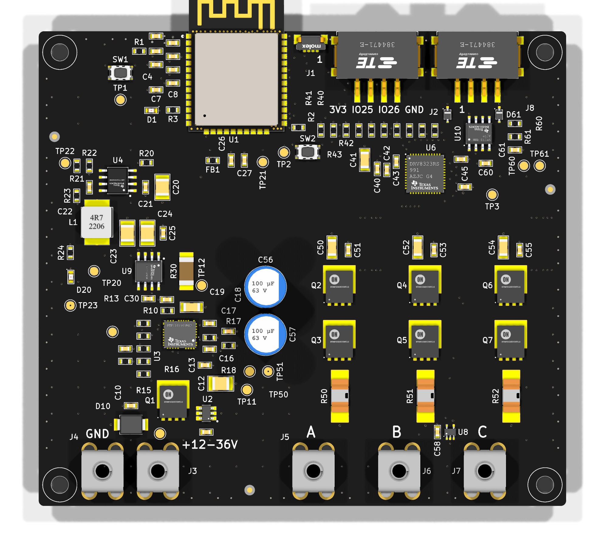

# ClaudeTestPCB — 3-Phase BLDC ESC (ESP32-WROOM-32E)

KiCad project for a 3-phase brushless motor ESC.

- **MCU:** ESP32-WROOM-32E, soldered SMD directly onto the PCB (no plug-in module)
- **Input:** 12–36V DC
- **Target continuous phase current:** ~5–10A
- **Control/telemetry:** UART + CAN bus
- Design follows [METU PowerLab PCB design rules](https://github.com/odtu/Powerlab/blob/master/KiCAD/PCB_DESIGN_RULES.md)
  and uses parts exclusively from [PowerLabKiCadLibraries](https://github.com/odtu/PowerLabKiCadLibraries).

## Status
- [x] GitHub repo created
- [x] ESP32-WROOM-32E added to PowerLabKiCadLibraries (odtu/PowerLabKiCadLibraries#2, merged)
- [x] Library additions + fixes (power symbols, mounting holes, fiducials, test pads, net ties, ESP32 footprint fix): odtu/PowerLabKiCadLibraries#3 (merged)
- [x] Schematic Rev B: full rebuild per the PowerLab rules; kicad-cli ERC 0 errors, netlist verified (see [hardware/ARCHITECTURE.md](hardware/ARCHITECTURE.md))
- [x] Library fixes found during layout (exposed pads, mask margins, logo/QR graphics, ESP32 3D model): odtu/PowerLabKiCadLibraries#5 (merged)
- [x] PCB Rev B: 4 layers, 100 × 90 mm; kicad-cli DRC 0 errors / 0 unconnected / 0 parity (see [hardware/ARCHITECTURE.md](hardware/ARCHITECTURE.md#pcb-rev-b))
- [x] Fab outputs: Gerber + drill zip, BOM, position file, assembly drawings in [hardware/fab](hardware/fab/README.md)

## Layout
- `hardware/` — KiCad project
